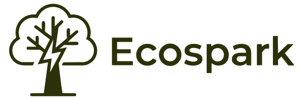

# 🌱 Ecospark - Turn Your Trash into Treasury

**Ecospark** is a comprehensive sustainability platform that bridges the gap between agricultural waste, land restoration, and community-driven farming in Nepal. We combine AI-powered insights, peer-to-peer resource sharing, and gamified missions to create a circular economy where waste becomes wealth and barren land becomes productive.



## 🎯 Mission

Stop ghosting the planet. We're bridging the gap between wasted resources and productive growth using AI, peer-to-peer sharing, and real-world missions. Our goal is to transform Nepal's approach to sustainability through technology, community, and gamification.

---

## ✨ Key Features

### 🛒 **Marketplace - The Upcycle Flex**
Turn agricultural waste into valuable resources:
- **AI-Powered Sustainability Scoring** (1-10 rating for each item)
- **Waste-to-Resource Matching** (rice husks, corn stalks, cow dung, etc.)
- **Equipment Rental** (temporary access to tractors, plows, tools)
- **Free & Paid Listings** (many items available for FREE)
- **Location-Based Discovery** (find resources near you)
- **Transparent Pricing** (no hidden fees)

**Problem Solved:** Farmers burn 312kg+ of agricultural waste annually. We connect waste producers with people who can repurpose it for composting, animal feed, mulch, and more.

### 🌱 **Land Revival - Touch Grass (Literally)**
Connect landless farmers with unused urban plots:
- **Free Land Access** (no rent, no purchase required)
- **Sweat & Share Missions** (prove commitment with geo-tagged before/after photos)
- **AI Crop Advisor** (personalized recommendations based on soil type)
- **Collaborative Farming** (multiple farmers can join same plot)
- **Progress Tracking** (0-100% restoration visualization)
- **Anti-Fraud System** (geo-location + duplicate detection)

**Problem Solved:** 40% of Nepali farmers are landless while thousands of hectares sit unused in Kathmandu valley. We create win-win-win solutions for landowners, farmers, and the environment.

### 🎯 **Missions - Proof of Work > Proof of Words**
Gamified environmental challenges with verified impact:
- **Earn Spark Points** (50-120 points per mission)
- **Geo-Tagged Verification** (before/after photos with GPS data)
- **Multiple Categories** (waste collection, land restoration, education, tool repair)
- **Anti-Cheat System** (AI duplicate detection, cooldown periods, location verification)
- **Leaderboards** (compete with community, regional rankings)
- **Achievement Badges** (unlock rewards and recognition)

**Problem Solved:** Environmental action lacks verification and rewards. We make sustainability competitive, measurable, and rewarding.

### 🤖 **Farm Assistant - Your 24/7 Agricultural Expert**
AI-powered farming companion:
- **Text & Image Analysis** (upload photos for instant diagnosis)
- **Crop Disease Detection** (identify pests, diseases, nutrient deficiencies)
- **Tool Repair Guidance** (DIY fixes with local materials)
- **Weather Integration** (Open-Meteo API for planting recommendations)
- **Sustainable Practices** (composting, crop rotation, organic pest control)
- **Nepali Context** (advice tailored for Nepal's climate and resources)

**Problem Solved:** 70% of farmers lack access to agricultural experts. We provide free, instant, expert advice anytime, anywhere.

### 🛠️ **Resources - The Greenhouse Effect**
Transparent marketplace for farming supplies:
- **Crowdsourced Pricing** (community-reported prices from multiple vendors)
- **Price Transparency** (see average, range, and best deals)
- **Vendor Comparison** (ratings, reviews, delivery options)
- **Quality Verification** (community ratings and verified sellers)
- **Group Buying** (bulk discounts through collective purchasing)
- **Local Alternatives** (organic, DIY, and Nepal-made options)

**Problem Solved:** Farmers pay 200-300% markup due to middlemen. We provide price transparency and direct vendor access, saving 30-70% on inputs.

### 📊 **Impact Dashboard - See Your Impact**
Real-time tracking of environmental contributions:
- **Personal Metrics** (Spark Points, missions completed, rank)
- **Environmental Impact** (waste diverted, land restored, CO₂ offset)
- **Community Stats** (collective achievements, growth trends)
- **Leaderboards** (global, regional, category-specific)
- **Historical Analytics** (monthly trends, year-over-year comparison)
- **Shareable Reports** (PDF exports, social media integration)

**Problem Solved:** Environmental contributions feel invisible. We quantify and visualize every action, making impact tangible and shareable.

---

## 🚀 Technology Stack

### Frontend
- **Framework:** Next.js 14 (App Router)
- **Language:** TypeScript
- **Styling:** Tailwind CSS
- **Animations:** AOS (Animate On Scroll)
- **Icons:** Lucide React
- **State Management:** React Hooks

### Backend
- **Database:** Supabase (PostgreSQL)
- **Authentication:** Supabase Auth (JWT-based)
- **Storage:** Supabase Storage (images, documents)
- **API Routes:** Next.js API Routes
- **Real-time:** Supabase Realtime subscriptions

### AI & External APIs
- **AI Assistant:** Google Gemini API (gemini-pro)
- **Weather Data:** Open-Meteo API
- **Image Analysis:** AI-powered crop disease detection
- **Geolocation:** Browser Geolocation API

### Security & Anti-Cheat
- **Geo-Verification:** GPS metadata validation
- **Duplicate Detection:** Image hash comparison
- **Cooldown System:** Time-based submission limits
- **AI Image Analysis:** Verify actual work completion

---

## 📦 Installation & Setup

### Prerequisites
- Node.js 18+ and npm
- Supabase account (free tier works)
- Google Gemini API key (optional, has fallback)

### 1. Clone the Repository
```bash
git clone https://github.com/yourusername/ecospark.git
cd ecospark
```

### 2. Install Dependencies
```bash
npm install
```

### 3. Environment Variables
Create a `.env.local` file in the root directory:

```env
# Supabase Configuration
NEXT_PUBLIC_SUPABASE_URL=your_supabase_url
NEXT_PUBLIC_SUPABASE_ANON_KEY=your_supabase_anon_key

# AI Configuration (Optional - has fallback)
GEMINI_API_KEY=your_gemini_api_key
```

### 4. Database Setup
Run the SQL migrations in your Supabase dashboard:
- `supabase/migrations/` - Contains all table schemas
- Enable Row Level Security (RLS) policies
- Set up storage buckets: `listings`, `land-photos`, `profiles`

### 5. Run Development Server
```bash
npm run dev
```

Open [http://localhost:3000](http://localhost:3000) to see the application.

### 6. Build for Production
```bash
npm run build
npm start
```

---

## 🗂️ Project Structure

```
ecospark/
├── app/                          # Next.js App Router pages
│   ├── api/                      # API routes
│   │   ├── farm-assistant/       # AI assistant endpoint
│   │   ├── analyze-image/        # Image analysis
│   │   ├── calculate-sustainability/ # Sustainability scoring
│   │   └── ...                   # Other API endpoints
│   ├── marketplace/              # Marketplace page
│   ├── land-revival/             # Land revival page
│   ├── mission/                  # Missions page
│   ├── farm-assistant/           # Farm assistant page
│   ├── resources/                # Resources page
│   ├── impact/                   # Impact dashboard
│   ├── profile/                  # User profile
│   ├── login/                    # Authentication
│   └── signup/                   # Registration
├── components/                   # Reusable React components
│   ├── Navbar.tsx                # Navigation bar
│   ├── Footer.tsx                # Footer
│   ├── AuthModal.tsx             # Authentication modal
│   ├── MissionCard.tsx           # Mission display card
│   └── ...                       # Other components
├── lib/                          # Utility functions
│   ├── supabase.ts               # Supabase client
│   ├── supabase-auth.ts          # Authentication helpers
│   ├── anti-cheat.ts             # Anti-cheat verification
│   └── mission-submission.ts     # Mission logic
├── public/                       # Static assets
├── .env.local                    # Environment variables
└── README.md                     # This file
```

---

## 🎨 Design Philosophy

### Visual Identity
- **Color Palette:** Deep forest green (#040d07) with vibrant green accents (#74c69d, #52b788)
- **Typography:** Serif headings for elegance, sans-serif for readability
- **Dark Theme:** Nature-inspired dark mode with green highlights
- **Animations:** Smooth AOS entrance animations, hover effects, micro-interactions

### User Experience
- **Mobile-First:** Optimized for smartphones (primary user device)
- **Responsive:** Adaptive layouts for tablet and desktop
- **Accessibility:** ARIA labels, keyboard navigation, screen reader support
- **Performance:** Optimized images, lazy loading, code splitting

---

## 🔐 Security Features

### Anti-Cheat System
1. **Geo-Location Verification:** Photos must contain GPS metadata matching mission location
2. **Duplicate Detection:** AI-powered image hash comparison prevents reusing photos
3. **Cooldown Periods:** 24-hour cooldown between similar missions
4. **AI Image Analysis:** Verifies actual work was completed
5. **Community Reporting:** Users can flag suspicious activity

### Authentication
- JWT-based authentication via Supabase
- Row Level Security (RLS) policies
- Secure session management
- Password encryption
- Email verification

---

## 📊 Impact Metrics (Current)

- **👥 Active Users:** 1,234 members
- **✅ Missions Completed:** 8,567
- **🗑️ Waste Diverted:** 312 tons
- **🌱 Land Restored:** 12,500 m²
- **🌳 Trees Planted:** 2,340
- **💨 CO₂ Offset:** 156 tons

---

## 🛣️ Roadmap

### Phase 1: MVP (Current)
- ✅ Marketplace with AI sustainability scoring
- ✅ Land revival with geo-verification
- ✅ Gamified missions system
- ✅ AI farm assistant
- ✅ Resources price transparency
- ✅ Impact dashboard

### Phase 2: Enhancement (Q2 2024)
- [ ] Mobile app (iOS/Android)
- [ ] Nepali language support
- [ ] Payment gateway integration
- [ ] Advanced analytics dashboard
- [ ] Video tutorials
- [ ] Community forums

### Phase 3: Scale (Q3 2024)
- [ ] Blockchain integration (NFT badges)
- [ ] Carbon credit marketplace
- [ ] Government partnerships
- [ ] Corporate CSR integration
- [ ] International expansion
- [ ] API for third-party integrations

---

## 🤝 Contributing

We welcome contributions! Here's how you can help:

1. **Fork the repository**
2. **Create a feature branch** (`git checkout -b feature/AmazingFeature`)
3. **Commit your changes** (`git commit -m 'Add some AmazingFeature'`)
4. **Push to the branch** (`git push origin feature/AmazingFeature`)
5. **Open a Pull Request**

### Development Guidelines
- Follow TypeScript best practices
- Use Tailwind CSS for styling
- Write meaningful commit messages
- Test on mobile devices
- Ensure accessibility compliance

---

## 📄 License

This project is licensed under the MIT License - see the [LICENSE](LICENSE) file for details.

---

## 👥 Team

**Ecospark** is built by a passionate team committed to making Nepal sustainable through technology.

---

## 📞 Contact & Support

- **Website:** [ecospark.com](https://ecospark.com)
- **Email:** support@ecospark.com
- **Twitter:** [@EcosparkNepal](https://twitter.com/EcosparkNepal)
- **Discord:** [Join our community](https://discord.gg/ecospark)

---

## 🙏 Acknowledgments

- **Supabase** for backend infrastructure
- **Google Gemini** for AI capabilities
- **Open-Meteo** for weather data
- **Unsplash** for demo images
- **Lucide** for beautiful icons
- **Tailwind CSS** for styling framework
- **Next.js** for the amazing framework

---

## 🌍 UN Sustainable Development Goals

Ecospark contributes to multiple UN SDGs:
- **SDG 2:** Zero Hunger (food production, land access)
- **SDG 12:** Responsible Consumption (waste reduction, circular economy)
- **SDG 13:** Climate Action (CO₂ offset, carbon sequestration)
- **SDG 15:** Life on Land (land restoration, biodiversity)
- **SDG 17:** Partnerships (community collaboration)

---

## 💡 Why Ecospark?

**Traditional Approach:**
- Farmers burn waste → Air pollution
- Land sits unused → Wasted potential
- No verification → Greenwashing
- Expensive inputs → High costs
- Isolated efforts → Limited impact

**Ecospark Approach:**
- Waste → Resource (marketplace)
- Unused land → Productive farms (land revival)
- Verified actions → Real impact (missions)
- Transparent pricing → Fair costs (resources)
- Community collaboration → Scaled impact (together)

---

## 🚀 Get Started

Ready to turn trash into treasury?

1. **Sign up** at [ecospark.com/signup](https://ecospark.com/signup)
2. **Browse the marketplace** for free resources
3. **Claim a land plot** and start farming
4. **Complete missions** to earn Spark Points
5. **Track your impact** on the dashboard

**Join 1,234 legends making Nepal sustainable, one mission at a time.** 🌱

---

<div align="center">

**Made with 💚 in Nepal**

[Website](https://ecospark.com) • [Documentation](https://docs.ecospark.com) • [Community](https://discord.gg/ecospark)

</div>
